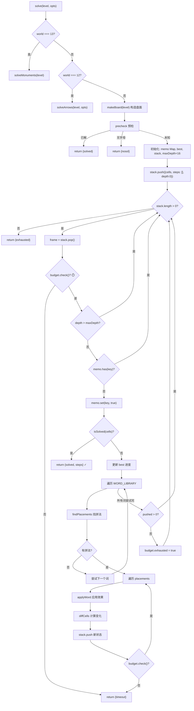
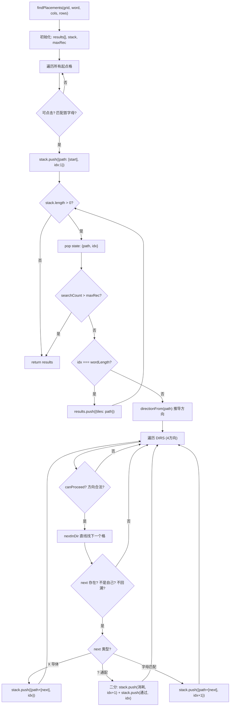

# Solve 求解流程图

## 主流程

## findPlacements 路径枚举

## applyWord 词效果应用

```mermaid
flowchart TD
    AW_A["applyWord(grid, word, placement)"] --> AW_B["wdef = WORD_LIBRARY[word]"]
    AW_B --> AW_C["tileCells = 过滤消耗的格子"]
    AW_C --> AW_D["board = applyBlackout 涂黑消耗格"]
    AW_D --> AW_E{"wdef 类型?"}

    AW_E -->|"globalLetter (TA)"| AW_TA["枚举所有存在的字母类型"]
    AW_TA --> AW_TA2["每种字母: 涂黑该类型的所有格"]
    AW_TA2 --> AW_TA3["生成多个结果板"]

    AW_E -->|"createLetter (BE)"| AW_BE["找所有空位 BLANK"]
    AW_BE --> AW_BE2["每个空位 × 每个有用字母"]
    AW_BE2 --> AW_BE3["生成带新字母的结果板"]

    AW_E -->|"diagonal (LOLO)"| AW_LO["找所有非空格 anchor"]
    AW_LO --> AW_LO2["每个唯一对角线: 涂黑对角线上所有格"]
    AW_LO2 --> AW_LO3["生成结果板"]

    AW_E -->|"onion (ABA)"| AW_AB["每个非空格: 加HP或解黑"]
    AW_AB --> AW_AB2["生成结果板"]

    AW_E -->|"clouds (W)"| AW_W["以 W 为参照, 复制形状到其他 anchor"]
    AW_W --> AW_W2["涂黑 W 和对应形状格"]

    AW_E -->|"extra=1 (LOK)"| AW_E1["枚举候选格, 每个额外涂黑1格"]
    AW_E -->|"extra=2 (TLAK)"| AW_E2["枚举同行/同列格对, 额外涂黑2格"]
    AW_E -->|"extra=0 (GRIVA)"| AW_E0["无额外效果"]
```

## 单词效果总览

| 词    | spell | 效果              | 说明                              |
| ----- | ----- | ----------------- | --------------------------------- |
| LOK   | LOK   | extra=1           | 涂黑 L,O,K + 额外1格              |
| TLAK  | TLAK  | extra=2, adjacent | 涂黑 T,L,A,K + 同行/列的2格       |
| TA    | TA    | globalLetter      | 涂黑 T,A + 全盘同字母格           |
| BE    | BE    | createLetter      | 涂黑 B,E + 在一个空位上创建新字母 |
| LOLO  | LOLO  | diagonal          | 涂黑 L,O,L,O + 某对角线全清       |
| ABA   | ABA   | onion             | 涂黑 A,B,A + 任选一格 +/- 洋葱层  |
| GRIVA | GRIVA | —                | 涂黑 G,R,I,V,A                    |
| W     | W     | clouds            | 涂黑 W + 以W为模板复制涂黑        |
